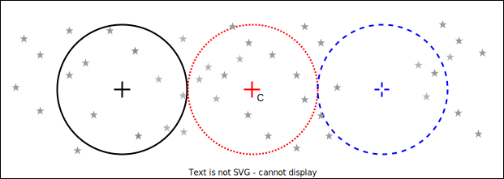
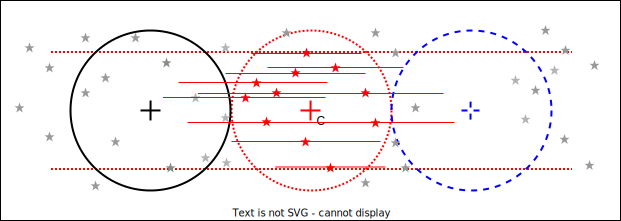

# Commensal observing with VLASS

Here I aim to begin planning what the automator will do during VLASS-style 
observing.

During VLASS observations:
- The telescope observes a continuous track varying in RA across the sky 
- These tracks overlap
- A source is typically present for at most 5 seconds as the primary field of 
view passes over it

## Approach 1 (easier)

For expedient development (time is short!), I propose an easier, discrete 
approach to start with.  

### 1.

In this first figure, the telescope is scanning in RA as shown. At time 
t1, the primary field of view of the telescope is centered on 
RA1, and at t2, RA2. RA1 and 
RA2 are two primary beamwidths apart. 

### 2.

The automator instructs the processing nodes to record from t1 to 
t2. It also instructs the phase center to be at C as
follows:

### 3. 

We know that VLASS scans overlap in RA, so we can constrain target sources to 
lie in a strip narrower than the primary field of view of the telescope. The 
targets to be observed are given in red. By limiting them within the 
primary field of view centered on C, we ensure that each source is 
recorded for a full transit of the primary field of view. 

### 4. 

Not all the stars within the circle around C1 will be visible for 
the full width of the primary field of view. The horizontal red lines give an 
indication of the portion of RA within which they are recorded as the primary 
field of view passes.

The automator will (via the target selector) issue coordinates for sources (in 
red in the diagram) to the recipe file generator. The recipe file should 
contain the start and stop coordinates for each source. The beamformer will be 
instructed to beamform on each of the sources, either zeroing the coefficients 
when a source leaves the field of view or ignoring the data during this time. 

### 5.

In this 'easy mode', the automator deals with discrete recordings, each covering a 
transit equivalent to two beamwidths. Each of these discrete recordings is 
handled completely separately with a separate beamformer recipe file. After 
recording, processing (upchannelisation, beamforming, SETI search and cleanup)
takes place. Some sections of sky are inherently missed, depending on how long 
processing takes. 

## Approach 2 (harder)

Here, we are able to shrink processing enough such that we can have the field
of view around each phase center overlap. `(Is this possible to do? Can phase 
centers be calculated for overlapping segments of data if this is done in real
time on the FPGAs?)` This way, none of the sky is missed. 
This means that overlapping sections of the recorded data are needed for each 
phase center calculation. We can also confine targets to a simple rectangular 
region around each phase center.

The overlapping sections of the recorded data are shown below:

